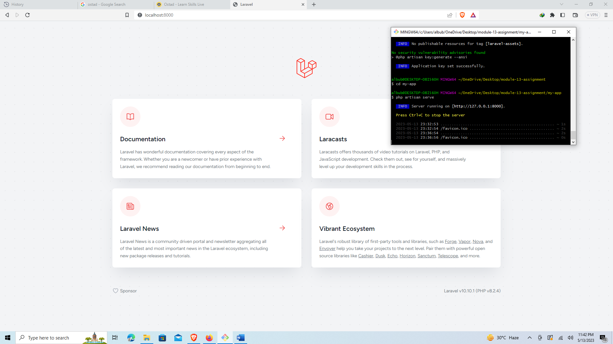
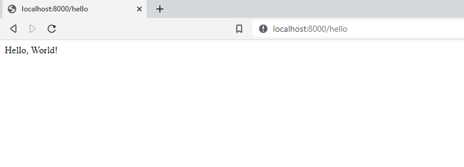

**Steps for install / create new Laravel Project:**

- Open cmd or git bash or any other command line tools in any desired location you want to create the Laravel project.
- Type composer create-project laravel/laravel your-project-name command and hit enter. This command will start installing the latest laravel version project on your computer.
- After installing go to the project directory by typing the command cd your-project-name
- Now run php artisan serve command. This artisan command will run the server on localhost:8000 port and provide and URL link of [**http://127.0.0.1:8000**](http://127.0.0.1:8000)
- And now you can copy the link open any browser and paste the url or type localhost:8000 on the browser address bar or simply press ctrl & click the url from the command line / git bash that will automatically open the project homepage on your default browser.

Figure 1: Running Laravel Project
 

**Laravel Folder Structure & it’s purposes:**

**app:** app folder contains the core code of the Laravel application. It includes sub folders of - 

- **Console:** This folder contains console commands used to perform tasks via CLI. It also stores **‘Kernel’** classes that register these commands with Laravel.
- **Exceptions:** This folder contains classes that handle applications exceptions and errors.
- **Http:** This folder contains classes that handle incoming HTTP requests and outgoing HTTP responses. This includes Controllers that handle request/response logic, Middleware that process requests before they reach Controllers, and Requests that validate incoming request data. It also has **Kernel.php** file which is used for register all the middleware including the new ones that a developer creates.
- **Models:** This folder contains classes that define the application's data models, which are used to interact with the application's database. These classes typically represent database tables, and contain methods for querying and manipulating data.
- **Providers:** It contains classes that register services with the Laravel application. These services can include third-party packages, custom classes, and configuration values. The app.php configuration file is used to define which service providers should be loaded by the application.

**bootstarp:** This folder contains the application's bootstrapping files and cache. Laravel's bootstrap process prepares the application environment, loads configuration files, registers service providers, and prepares the application for use.

**config:** This folder contains all configuration files for the application. Configuration files include database connection details, application settings, logging settings, and other environment-specific settings.

**database:** This folder contains database migrations, seeds, and factories. Migrations are PHP files that define changes to the application's database schema. Seeds provide initial data for the application's database, while factories generate sample data for testing purposes.

**public:** This folder contains the entry point for the application and public assets like images, CSS, and JavaScript files. The index.php file in this folder serves as the entry point for the application. Public assets like images, CSS, and JavaScript files can be stored here.

**resources:** This folder contains views, language files, and frontend assets. Views are templates that define the application's HTML structure. Language files provide translations for the application's user interface. Frontend assets like SCSS, JavaScript, and images can be stored here.

**routes:** This folder contains all of the application's route definitions. Routes define the URLs and HTTP methods that the application should respond to and specify which Controller method should be executed.

**storage:** This folder contains temporary files, log files, and cache. Laravel stores temporary files like session data and file uploads here. Log files contain information about errors and other events. Cache is used to improve the performance of the application by storing frequently used data.

**tests:** This folder contains automated test cases. Laravel provides tools for automated testing of the application. Tests are stored in this folder and can be executed using the command line.

**vendor:** This folder contains third-party packages installed via Composer. Laravel uses Composer to manage its dependencies. Third-party packages are installed in this folder.

Figure 2: running /hello route image
 
